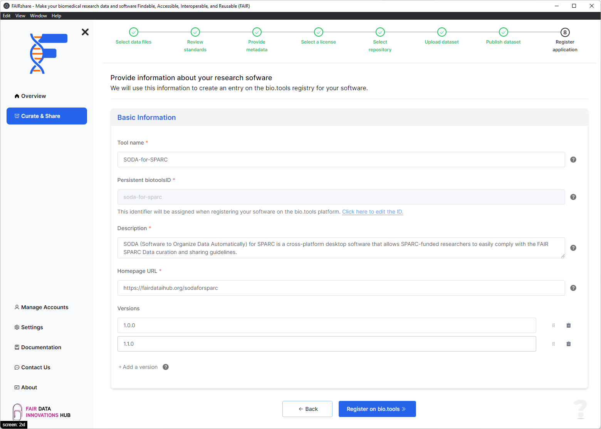

## Background

bio.tools requires some metadata about your software application before publishing. This step will help you fill in the required fields. FAIRshare will try to prefill any fields that are available based on your responses to the previous steps. You can edit this metadata if you need to. Your responses to these fields will be shown in your public bio.tools record.

## How to

### Basic information

In this section you will be asked to provide the basic information about your dataset. Fields marked with an asterisk are required.

- **Tool name** \*

  - Canonical software name assigned by the software developer or service provider, e.g. `needle`

    :::info

    - name may only contain space, uppercase and lowercase letters, decimal digits, plus symbol, period, comma, dash, underscore, colon, semicolon and parentheses.
    - line feeds, carriage returns, tabs, leading and trailing spaces, and multiple spaces are not allowed / will be removed.

    :::

- **Persistent biotoolsID** \*

  - Unique ID (case insensitive) of the tool that is assigned upon registration of the software in bio.tools, normally identical to tool name, e.g. `needle`.

    :::info

    - The biotoolsID is a URL-safe and Linked-Data-safe derivative of (often identical to) the tool name. Allowed characters are uppercase and lowercase English letters, decimal digits, hyphen, period, and underscore. Spaces can be preserved as underscore ('\_').
    - Note that this ID must be unique on the bio.tools website.

    :::

- **Description** \*

  - Textual description of the software, e.g. 'needle reads two input sequences and writes their optimal global sequence alignment to file. It uses the Needleman-Wunsch alignment algorithm to find the optimum alignment (including gaps) of two sequences along their entire length. The algorithm uses a dynamic programming method to ensure the alignment is optimum, by exploring all possible alignments and choosing the best.'

    :::info

    - minimum 10 and maximum 1000 characters.
    - line feeds, carriage returns, tabs, leading and trailing spaces, and multiple spaces are not allowed / will be removed.

    :::

- **Homepage URL** \*

  - Homepage of the software, or some URL that best serves this purpose, e.g. `http://emboss.open-bio.org/rel/rel6/apps/needle.html`

- Versions

  - Version information (typically a version number) of the software applicable to this bio.tools entry, e.g. `6.4.0, 1.1 - 1.4, 2.0-alpha, 2.0-beta-01 - 2.0-beta-04, 2.0.0`

  :::info

  - name may only contain space, uppercase and lowercase English letters, decimal digits, plus symbol, period, comma, dash, colon, semicolon and parentheses.
  - line feeds, carriage returns, tabs, leading and trailing spaces, and multiple spaces are not allowed / will be removed.

  :::

After filling all the relevant data in the above sections, you can click on the `Register on bio.tools` button to move on to the register your application on the platform.

:::caution
Adding an entry on the bio.tools platform is a permanent action. You will be able to edit the metadata of your entry later but you will not be able to remove the it from the platform without the help of an admin.
:::

import PageFeedback from "@site/src/components/PageFeedback";

<PageFeedback />
