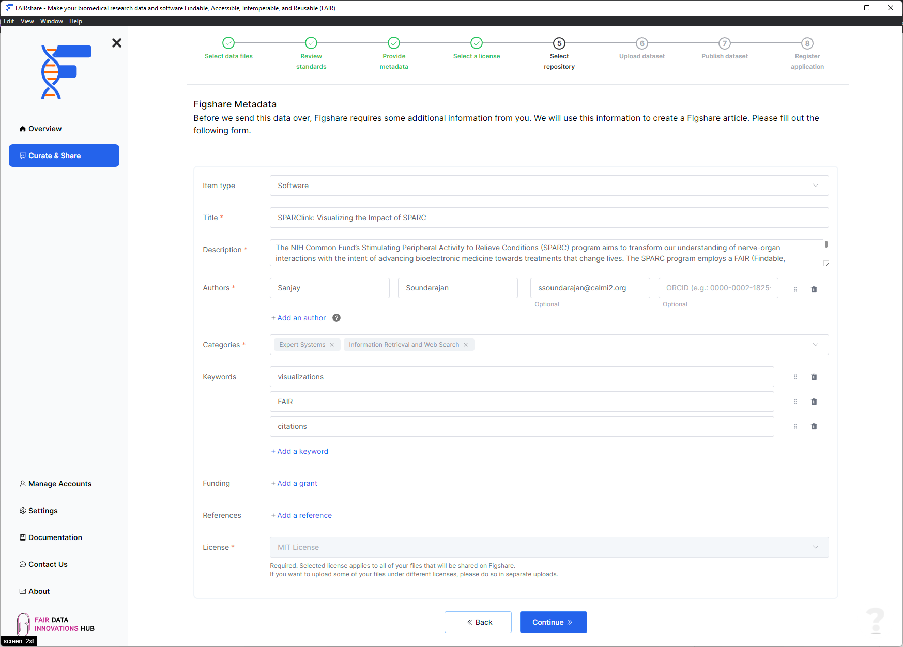

## Background

Figshare requires some metadata about your dataset before publishing. This step will help you fill in the required fields. FAIRshare will try to prefill any fields that are available based on your responses to the previous steps. You can edit this metadata if you need to. Your responses to these fields will be shown in your public Figshare record.

## How to

### Basic information

In this section you will be asked to provide the basic information about your dataset. Fields marked with an asterisk are required.

- **Item type** \*
  - Select the type of item you are publishing.
- **Title** \*
  - This is the name of your dataset.
- **Description** \*
  - This is a short description of your dataset. Use a description that is identifiable. This will be shown with your dataset on Figshare.
- **Authors** \*
  - **Name (s)** \*
    - This is the name(s) of the author of your research software. This should be in the format `Family name(s), given name(s)`.
  - **Affiliation** \*
    - This is the affiliation of the author of your research software.
  - ORCID
    - This is the ORCID of the author of your research software.
- **Categories** \*
  - Select the categories that best describe your dataset. You can select multiple categories. These categories will be shown with your dataset on Figshare.
- Keywords
  - This is a list of keywords that describe your dataset.
- Funding
  - This is a list of funding sources that supported the creation of your dataset.
- References
  - This is a list of references that are related to your dataset.
- License
  - This is the license that you would like to apply to your dataset. You will not be able to edit this field. If you would like to change the license, please go back to the previous step and change the license there.

After filling all the relevant data in the above sections, you can click on the `continue` button to move on to the next step.

import PageFeedback from "@site/src/components/PageFeedback";

<PageFeedback />
