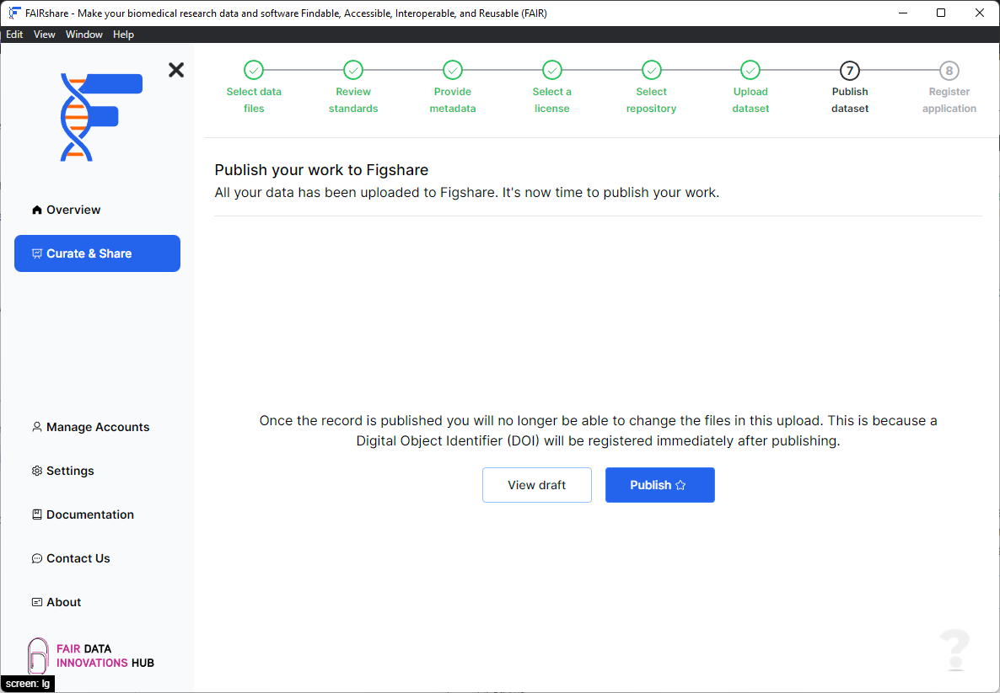
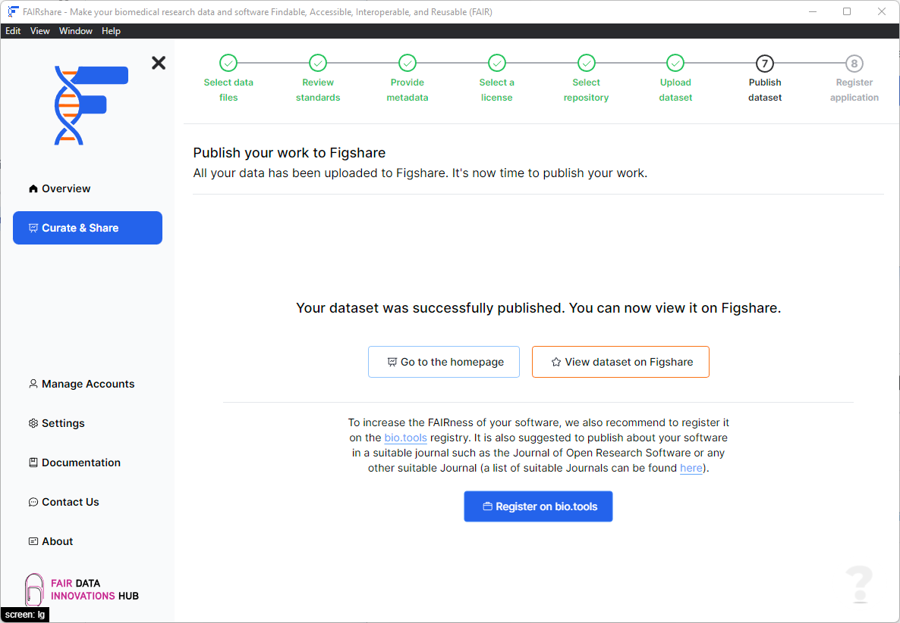

## Background

In this page you will have quick access to see your Figshare deposition draft and to publish your Figshare deposition.

## How to

- Click on the `View draft` button to view your Figshare deposition draft.
- Click on the `Publish` button to publish your Figshare deposition.

:::caution
The publish action is permanent and cannot be undone. Please be sure you have made all necessary changes before publishing.
:::

After your dataset has been published you will be able to view the DOI of your dataset.

:::tip
If you are publishing biomedical research software, we also recommend you to register your software application on [bio.tools](https://bio.tools/) to make it easier for other researchers to find your software.
:::

:::tip
If you started from a GitHub repository you can also create a release on GitHub directly through FAIRshare
:::
