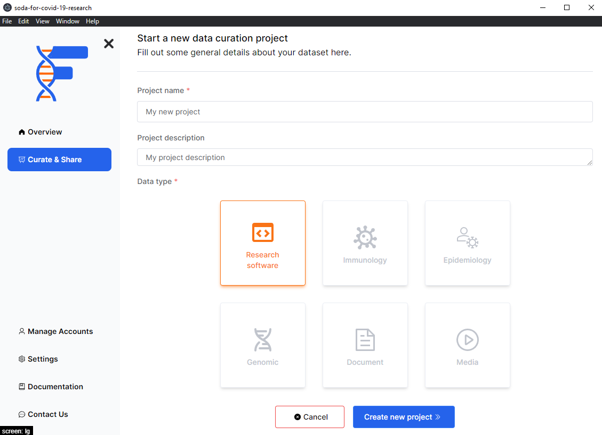

## Background

From this page you will be able to create a new project. Think of projects as a set of data that you are planning on making FAIR. Each project will require a name and a description so that you will be able to identify it later.

## How to

- Add a name and description to your project
- Select the data you want to upload
- Click on the `Create new project` button

:::info
Only `Research software` is supported at this time. We will be adding support for other data types in the future. View the roadmap to see what is in the pipeline. You can let us know if there is a specific data type you would like to see supported.
:::

import PageFeedback from "@site/src/components/PageFeedback";

<PageFeedback />
