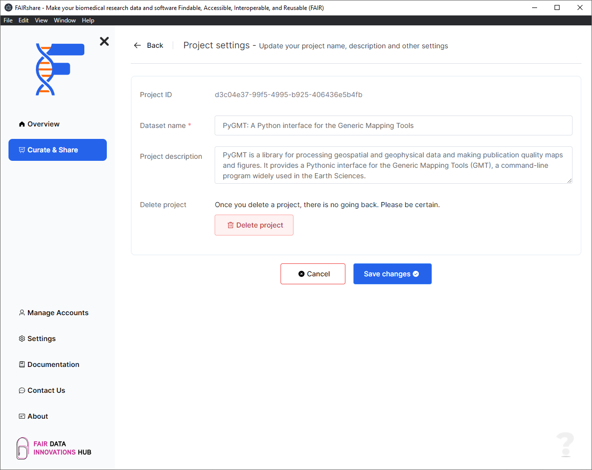

## Background

You will be able to modify your project settings and delete your project from this page.

## How to

### Edit project settings

To get to this section, left click on the project you want to modify and then click the `Project settings` button at the bottom right of the page.

Here you will be able to modify your project's name and description. To save your changes, click the `Save changes` button.

:::note
At the moment you will not be able to change the data types that you have selected for your project.
:::

### Delete a project

To delete your project, click the `Delete project` button. You will be prompted to confirm your action with a pop-up message.
Within the text box, type in the `project name` and click the button.

:::warning
This action is permanent and cannot be reverted back! Please be careful.
:::

import PageFeedback from "@site/src/components/PageFeedback";

<PageFeedback />
