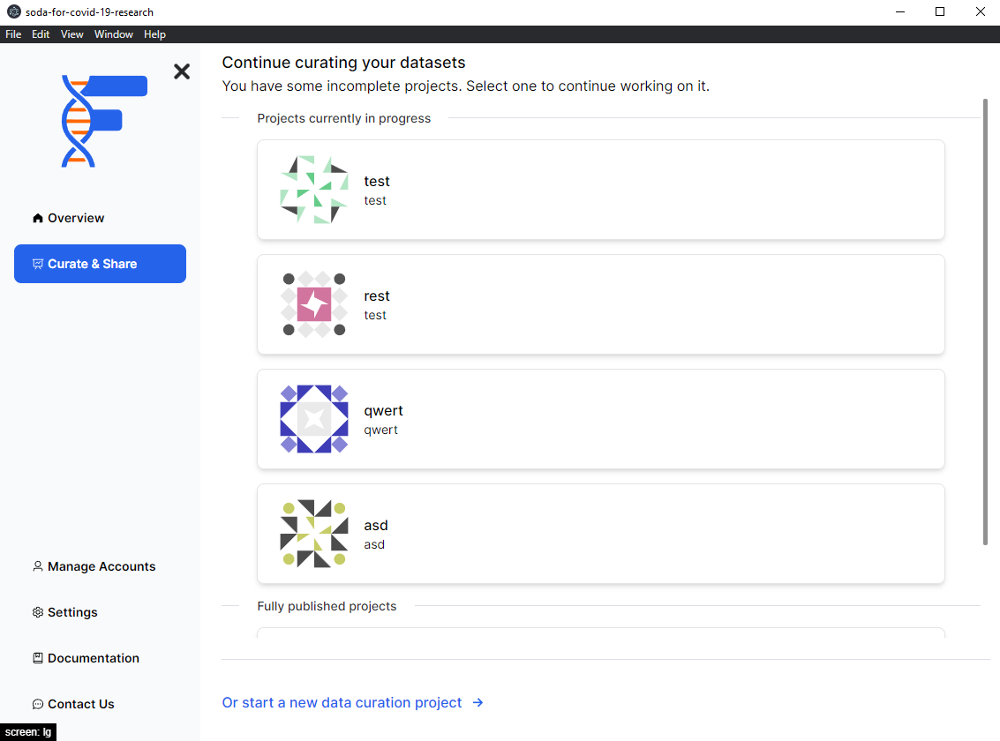

## Background

Within FAIRshare, projects can be defined as a complete set of data that you are planning on making FAIR. In here you will be able to view all your draft and published projects.

Some key infomation about each project will also be shown here. This should help you to understand what each project is about and what it is intended for.

You can create a new project by clicking on the `Start a new data curation project` button at the bottom right of the page. You can learn more about [this step here](/)

Click on a specific project to get the following options:

1. [Edit the project](project-settings)
2. [Start curation](/)

import PageFeedback from "@site/src/components/PageFeedback";

<PageFeedback />
