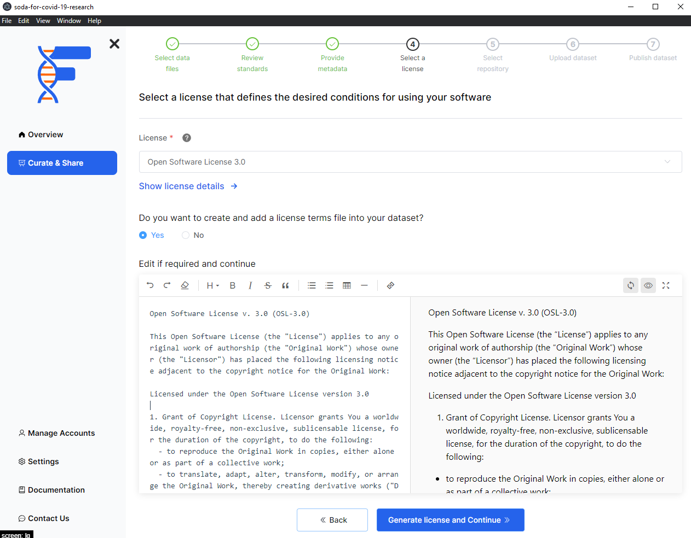

## Background

To make your data FAIR, you are are required to select a license for your data. Within this feature of FAIRshare you can select a license from the list of licenses that are available to you. To learn more about the licenses available to you, please see the [SPDX License List](https://spdx.org/licenses/) page.

Using FAIRshare, you can select a license and also generate a license file for your data. This license file will be automatically created before you upload your data to a data repository.

:::info
If you are using a GitHub repository as the source of your data, your license will be automatically filled in for you. If you already have a license file on GitHub, you don't have to change anything. However if you are looking to change the license file of your repository, you can use this section to do so. FAIRshare will handle the changes for you.
:::

## How to

- Select a license from the list of licenses that are available to you
- Click on the `Show license details` option to view the license details
- Click `Yes` if you want FAirshare to automatically generate a license file for your data. You will be able to edit the final license file with the editor shown.
- Click on the `Generate license file and Continue` button to move to the next step.

:::tip
Use the left side of the editor to modify the license file. The right panel is a preview of what your final license file will look like.
:::

import PageFeedback from "@site/src/components/PageFeedback";

<PageFeedback />
