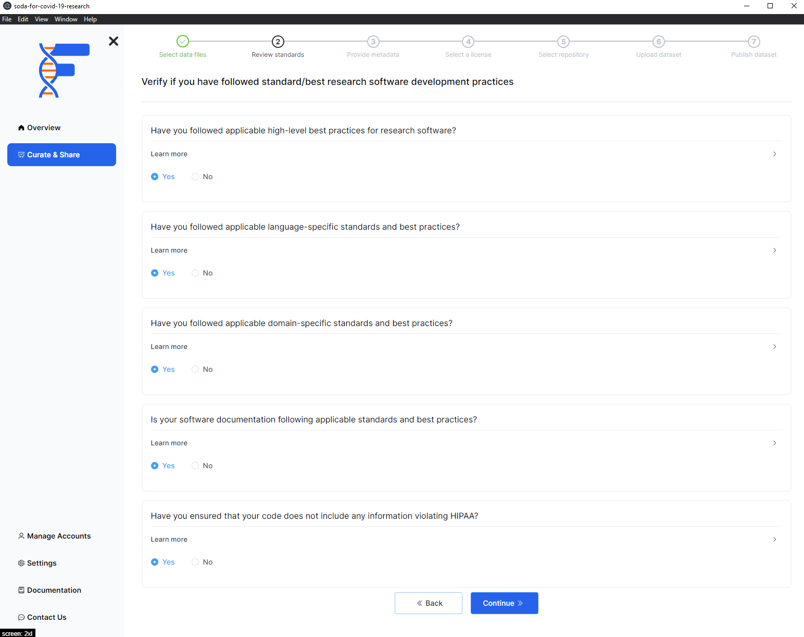

## Background

To make research software FAIR, you need to make sure that your code meets the best practices. Within this section you will be asked a series of questions to help you verify that your code meets the standards required. Some helpful tips will also be provided if you find that you are lacking in some of the best practices.

## How to

- Answer the questions in the [best practices checklist](/)
- Click on the `Continue` button

import PageFeedback from "@site/src/components/PageFeedback";

<PageFeedback />
