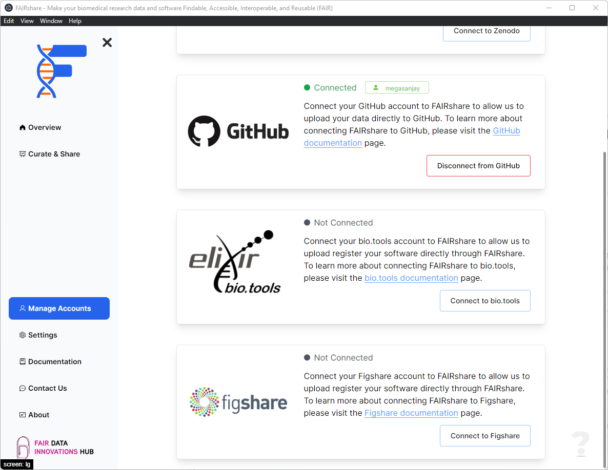
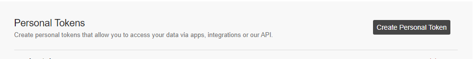

## Overview

FAIRshare will need to connect to Figshare to both upload your data as well as read your previously submitted depositions. At the moment there is only one way to integrate FAIRshare with Figshare.

## How to

1. Click on the `Connect to Figshare` at the bottom right position of the card.
   
2. In the following prompt enter your Figshare API token.

   - You can generate a token directly on Figshare using this link: https://figshare.com/account/applications

     - You might need to login if you haven't already.
     - Click on the `Create Personal Token` button.

       

     - Provide a `description` to the token so that you can identify it later.

       

   - After you have generated your account you can provide the token in the prompt within FAIRshare.
     

   - Click on the `Login` button to continue. If your token is valid FAIRshare will show you a successfully connected notification.

import PageFeedback from '@site/src/components/PageFeedback';

<PageFeedback />
