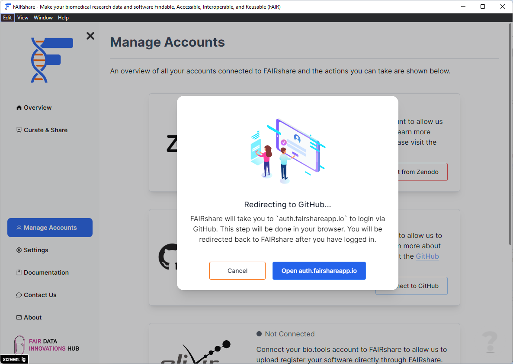

## Overview

FAIRshare can be used to make your research software on GitHub FAIR. This is a great way to share your research with the world and to make it available to the public so we have made it easy to integrate FAIRshare with GitHub.

## How to

To connect FAIRshare with GitHub you can either provide a [personal access token](#connect-with-token) with the appropriate scopes or you can allow [FAIRshare to connect with GitHub](#connect-with-username) and create a token for you.

:::info
We recommend using the [Connect with username](#connect-with-username) option since this will make sure that you have the correct scopes needed to make your repositories FAIR.
:::

#### Scopes

Regardless of which option you choose, the following scopes will be requested from your GitHub account. An explanation of each scope is provided below.

- `repo` - Grants full access to repositories, including private repositories. That includes read/write access to code, commit statuses, repository and organization projects. FAIRshare will need to be able to read and write to your repositories.
- `user` - Grants read/write access to profile info only. FAIRshare will need to be able to read your information from your profile to fill in your information for the relevant metadata files.
- `admin:org_hook` - Grants read and write access to organization hooks. Note: OAuth tokens ([connecting with username](#connect-with-username)) will only be able to perform these actions on organization hooks which were created by the OAuth App. [Personal access tokens](#connect-with-token) will only be able to perform these actions on organization hooks created by a user.
- `admin:repo_hook` - Grants read and write access to repository hooks in public or private repositories. This scope is only requested by FAIRshare to create hooks on repositories for Zenodo or other data repository integration.

### Connect with username

1. Click on the `Connect to GitHub` at the bottom right position of the card.
   
2. Click on the `Connect with username` button in the popup.
   

   This will create a new window where you can login to GitHub. You will be asked to provide your GitHub username and password to allow FAIRshare to connect to GitHub.
   

   :::info
   FAIRshare cannot see or read the username or password you enter in this login window. If your login is successful FAIRshare only stores an authentication token that allows the application to connect to GitHub and read and write to your repositories.
   :::

3. If your login is successful FAIRshare will show you a successfully connected notification.

### Connect with token

You can also provide a personal access token that has the correct scopes to let FAIRshare read and write to your repositories.

The token can be generated using the following link: https://github.com/settings/tokens/new

:::note
You will need the following scopes on your personal access token: `admin:org_hook`, `admin:repo_hook`, `repo`, `user`
:::

1. Click on the `Connect to GitHub` at the bottom right position of the card.
   
2. Click on the `Connect with username` button in the popup.
   
3. In the following prompt enter your GitHub personal access token.
   
   - Click on the `OK` button to continue. If your token is valid FAIRshare will show you a successfully connected notification.

import PageFeedback from '@site/src/components/PageFeedback';

<PageFeedback />
