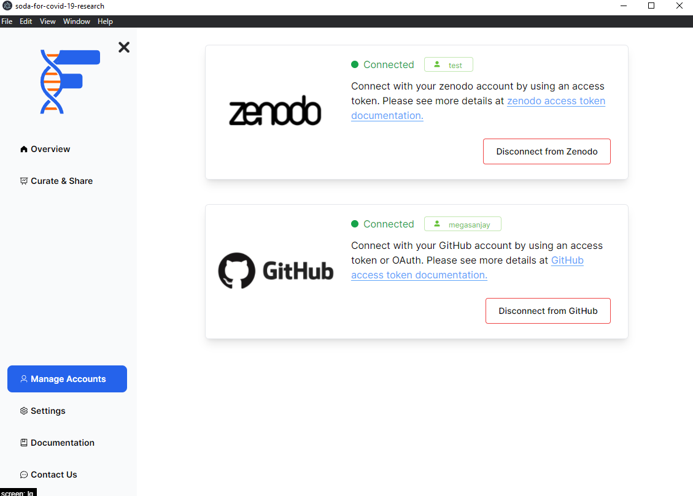

# Overview

This section is used to provide you a quick overview of all the connected integrations between FAIRshare and the different data sources and repositories.

From here you will be able to manage your connections. To get more infomation about the different integrations, please refer to the appropriate section below.

Currently FAIRshare is integrated with the following repositories:

- GitHub: [Click here to learn more](connect-to-github)
- Zenodo: [Click here to learn more](connect-to-zenodo)

