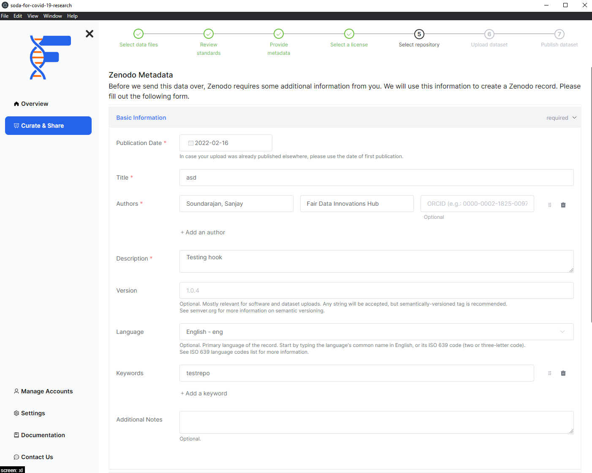

# Add metadata for Zenodo

## Background

Zenodo requires some metadata about your dataset before publishing. This step will help you fill in the required fields. FAIRshare will try to prefill any fields that are available based on your responses to the previous steps. You can edit this metadata if you need to. Your responses to these fields will be shown in your public Zenodo record.

## How to

### Basic information

In this section you will be asked to provide the basic information about your dataset. Fields marked with an asterisk are required.

- **Publication date** \*
  - This is the date that your dataset was published. In case your upload was already published elsewhere, please use the date of first publication.
- **Title** \*
  - This is the name of your dataset.
- **Authors** \*
  - **Name (s)** \*
    - This is the name(s) of the author of your research software. This should be in the format `Family name(s), given name(s)`.
  - **Affiliation** \*
    - This is the affiliation of the author of your research software.
  - ORCID
    - This is the ORCID of the author of your research software.
- **Description** \*
  - This is a short description of your dataset. Use a description that is identifiable. This will be shown in the dataset selection screen on Zenodo.
- Version
  - This is the version of your dataset.
- Language
  - This is the primary language of your dataset.
- Keywords
  - This is a list of keywords that describe your dataset.
- Additional notes
  - This is any additional notes you want to add about your dataset.

### License

This section will not be editable by the user. To make a dataset FAIR it must have `Open Access`. In order to change the license of your dataset, please go to the [Pick a license](select-a-license) page.

:::info
We will be adding support for the other embargoed `Access rights` in the future.
:::

### Related/alternate identifiers

In this section you will be asked to provide the identifiers of any related datasets and/or publications. You can only use DOIs or URLs.

- **Related identifier** \*
  - This is the DOI or URL of the publication or dataset.
- Relationship
  - This is the relationship between your identifier and the dataset about to published.
- Resource type
  - This is the type of the identifier.

### Contributors

In this section you will be asked to provide the information about the contributors of your dataset.

- **Name (s)** \*
  - This is the name(s) of the contributor of your research software. This should be in the format `Family name(s), given name(s)`.
- **Affiliation**
  - This is the affiliation of the contributor of your research software.
- ORCID
  - This is the ORCID of the contributor of your research software.
- Contributor type
  - This is the type of contributor.

### References

In this section you will be asked to provide the information about the references in your dataset.

### Journal

If your dataset is connected to a journal article, you can provide the information about the journal here. All of the fields in here are mandatory if available.

- Journal title
  - This is the title of the journal.
- Volume
  - This is the volume of the journal.
- Issue
  - This is the issue of the journal.
- Pages
  - This is the pages of the journal.

### Conference

If your dataset is connected to a Conference article, you can provide the information about the Conference here. All of the fields in here are mandatory if available.

- Conference title
  - This is the title of the conference.
- Acronym
  - This is the acronym of the conference.
- Dates
  - This is the start and end date of the conference.
- Place
  - This is the location of the conference. The city and country should be separated by a comma.
- Website
  - This is the website of the conference.
- Session
  - This is the session of the conference.
- Part
  - This is the part within a session.

### Book/Report/Chapter

If your dataset is connected to a book, chapter or report, you can provide that information here. All of the fields in here are mandatory if available.

- Publisher
  - This is the publisher of the book.
- Place
  - This is the location of the publisher. The city and country should be separated by a comma.
- ISBN
  - This is the ISBN of the book.
- Book Title
  - This is the title of the book.
- Pages
  - This is the pages of the book.

### Thesis

If your dataset is connected to a thesis publication, you can provide that information here. All of the fields in here are mandatory if available.

- Awarding university
  - This is the awarding university of the thesis.
- Supervisors
  - Name (s)
    - This is the name(s) of the supervisor of your research software. This should be in the format `Family name(s), given name(s)`.
  - Affiliation
    - This is the affiliation of the supervisor of your research software.
  - ORCID
    - This is the ORCID of the supervisor of your research software.

### Subjects

Specify subjects from a taxonomy or controlled vocabulary. Each term must be uniquely identified (e.g. a URL). For free form text, use the keywords field in basic information section. This section is optional.

- Term
  - This is the term of the subject.
- Identifier
  - This is the identifier of the subject.

After filling all the relevant data in the above sections, you can click on the `continue` button to move on to the next step.

import PageFeedback from "@site/src/components/PageFeedback";

<PageFeedback />
