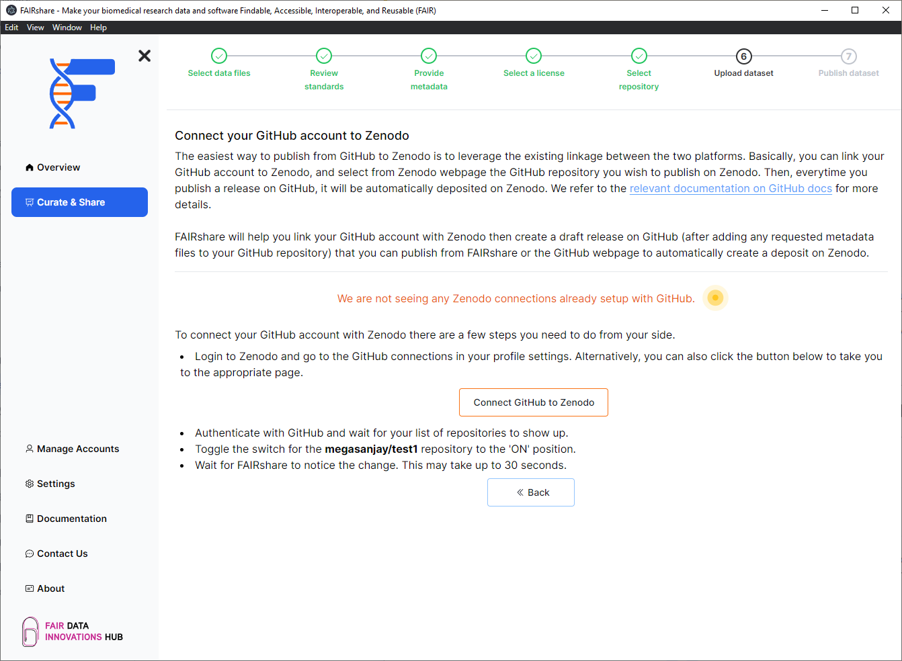
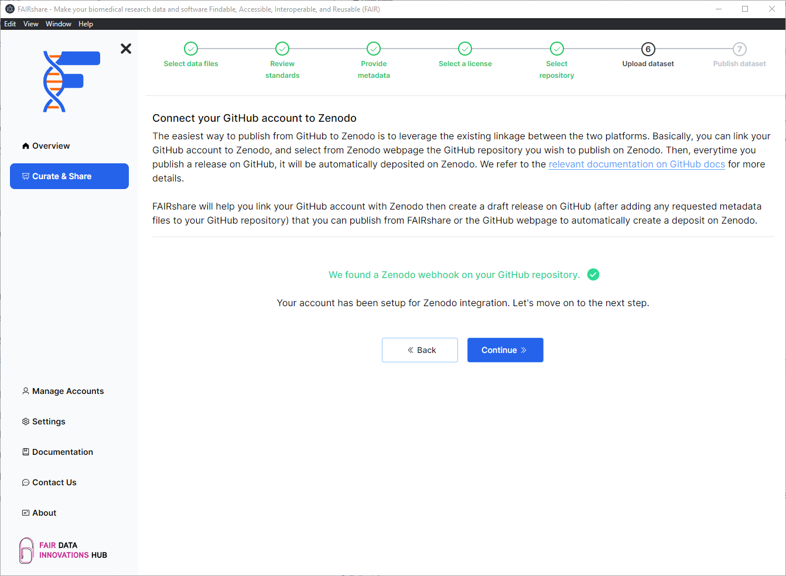

## Background

:::info
You will only see this page if you are trying to connect a GitHub repository to Zenodo.
:::

To setup the connection between Zenodo and GitHub you will need to have a GitHub account and a Zenodo account. Zenodo uses a system of workflows to manage the submission of data to the repository. You won't have to worry too much about this since Zenodo handles the creation of this connection for you. You will only need to enable this connection in Zenodo's interface.

FAIRshare will check your repository to verify that everything is setup for this connection.

## How to

1. Click on the `Connect GitHub to Zenodo` button or visit the url here: https://zenodo.org/account/settings/github
2. Follow the instructions on Zenodo to authenticate your GitHub credentials with Zenodo.
3. Toggle the switch for the repository you want to connect.
4. Wait for FAIRshare to verify that the connection is setup. This might take a few seconds. Please be patient.

When FAIRshare finds the appropriate webhook connection it will display a success message. You can now click on the `Continue` button to continue to the next step.

