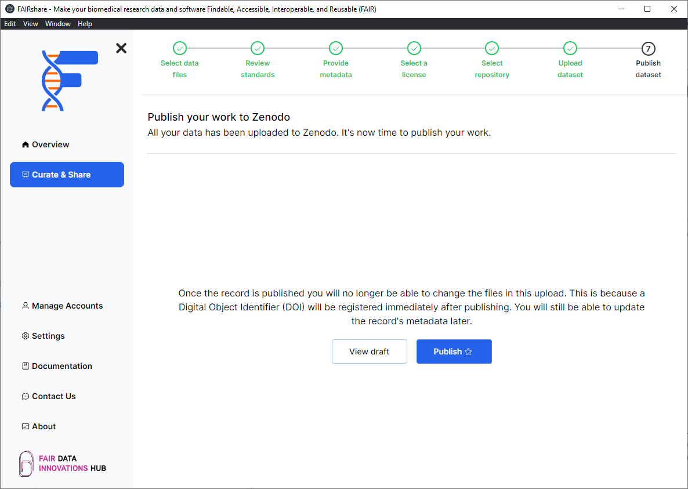
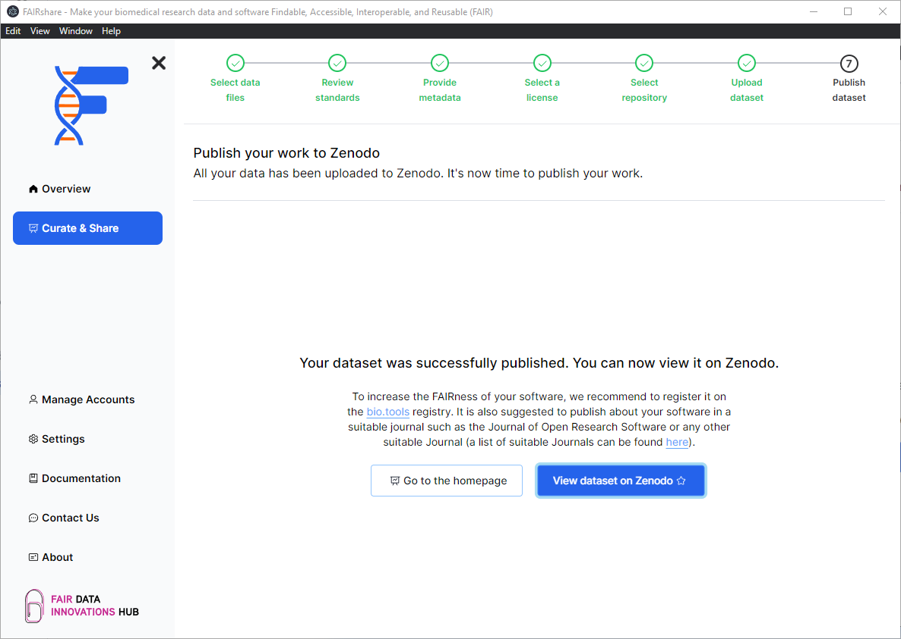

## Background

:::info
You will only see this page if you are uploading a dataset to Zenodo from your local computer.
:::

In this page you will have quick access to see your Zenodo deposition draft and to publish your Zenodo deposition.

## How to

- Click on the `View draft` button to view your Zenodo deposition draft.
- Click on the `Publish` button to publish your Zenodo deposition.

:::caution
The publish action is permanent and cannot be undone. Please be sure you have made all necessary changes before publishing.
:::

After your dataset has been published you will be able to view the DOI of your dataset.

:::tip
If you are publishing biomedical research software, we also recomment you to regsister your software application on [bio.tools](https://bio.tools/) to make it easier for other researchers to find your software.
