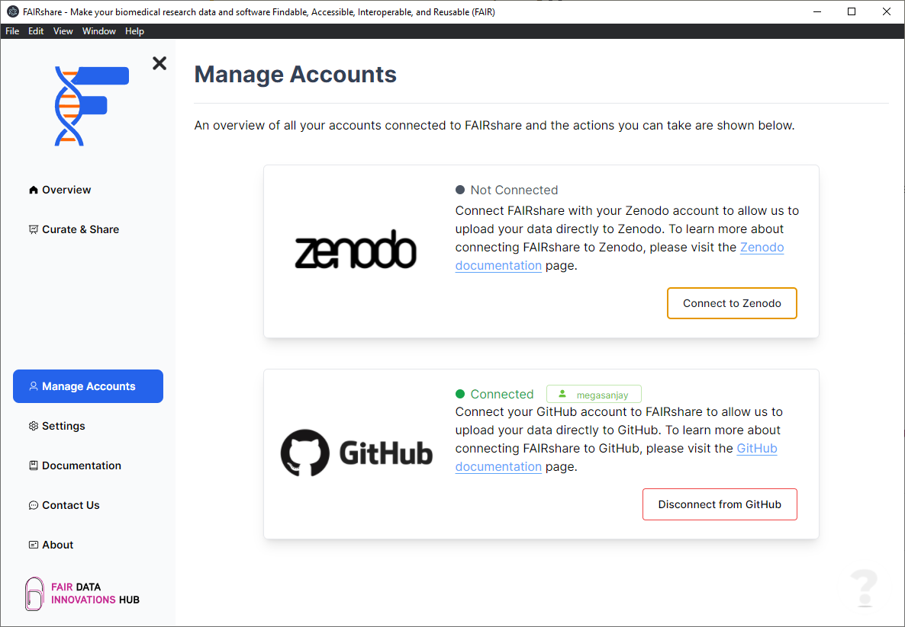
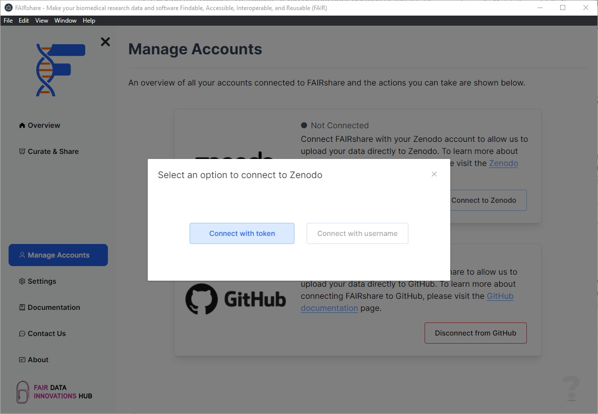
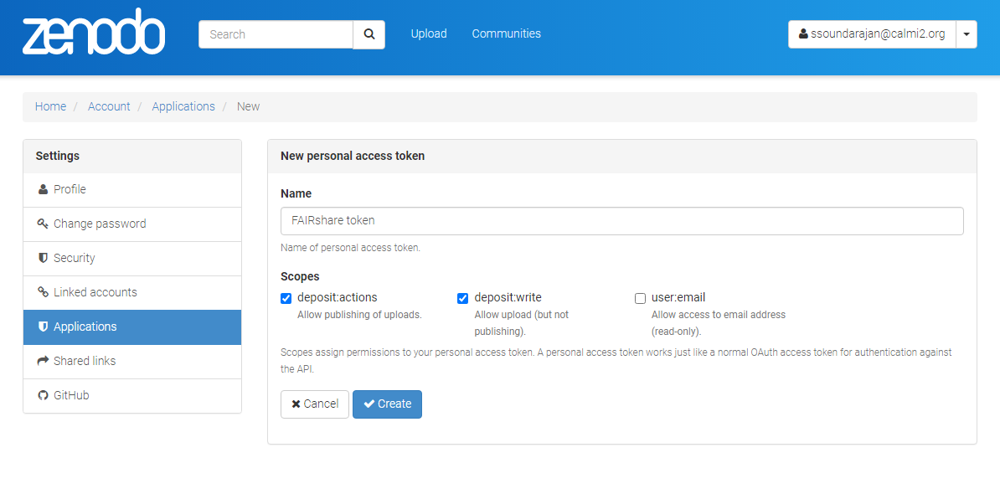
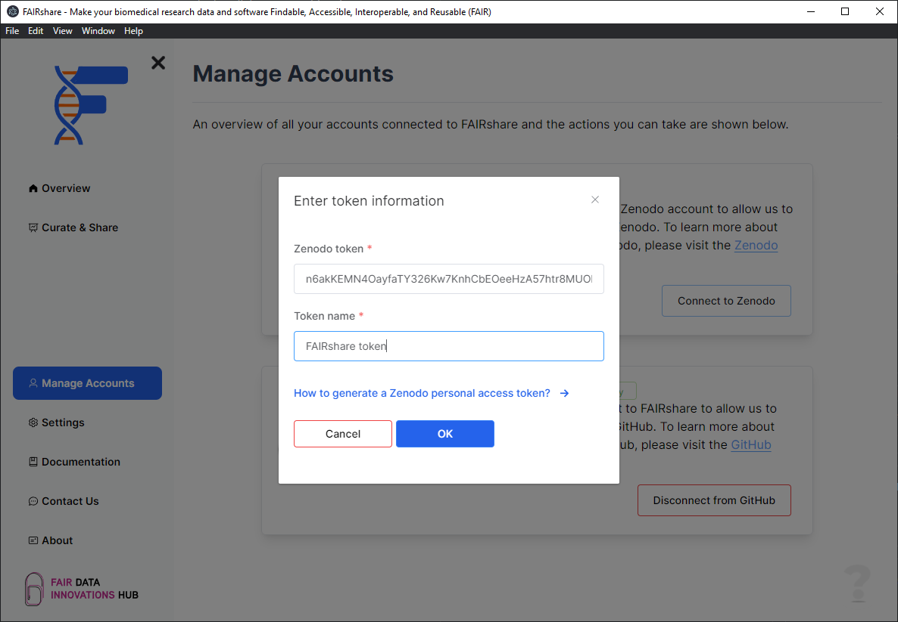

## Overview

FAIRshare will need to connect to Zenodo to both upload your data as well as read your previously submitted depositions. At the moment there is only one way to integrate FAIRshare with Zenodo.

## How to

1. Click on the `Connect to Zenodo` at the bottom right position of the card.
   
2. Click on the `Connect with token` button in the popup.
   
3. In the following prompt enter your Zenodo API token.

   - You can generate a token directly on Zenodo using this link: https://zenodo.org/account/settings/applications/tokens/new/

     - You might need to login if you haven't already.
     - Provide a name to the token so that you can identify it later.
     - Provide the scopes of `deposit:actions` and `deposit:write`. These are the only scopes that are required and this is **mandatory**.

     

   - After you have generated your account you can provide the token in the prompt within FAIRshare.
     

   - Click on the `OK` button to continue. If your token is valid FAIRshare will show you a successfully connected notification.

import PageFeedback from '@site/src/components/PageFeedback';

<PageFeedback />
