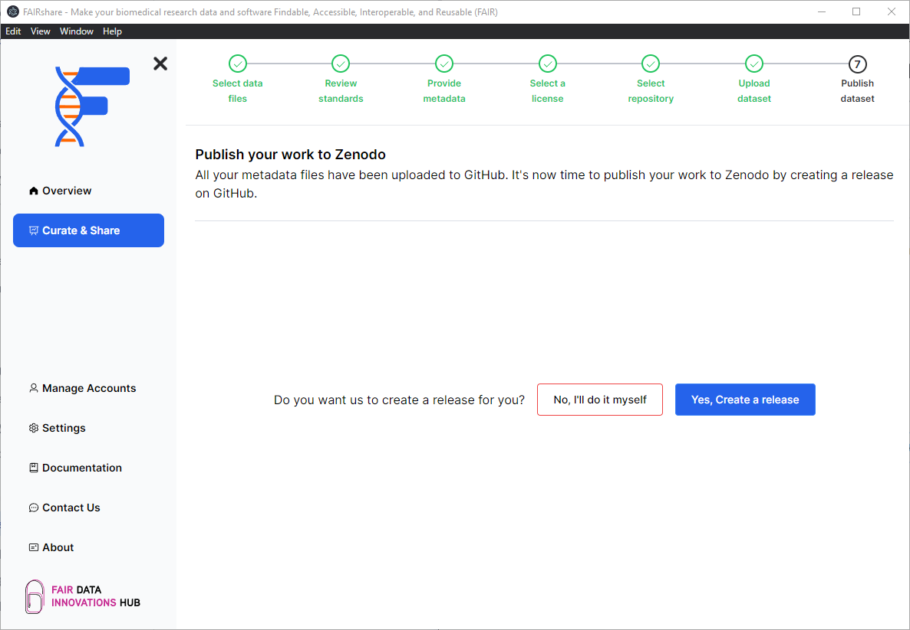
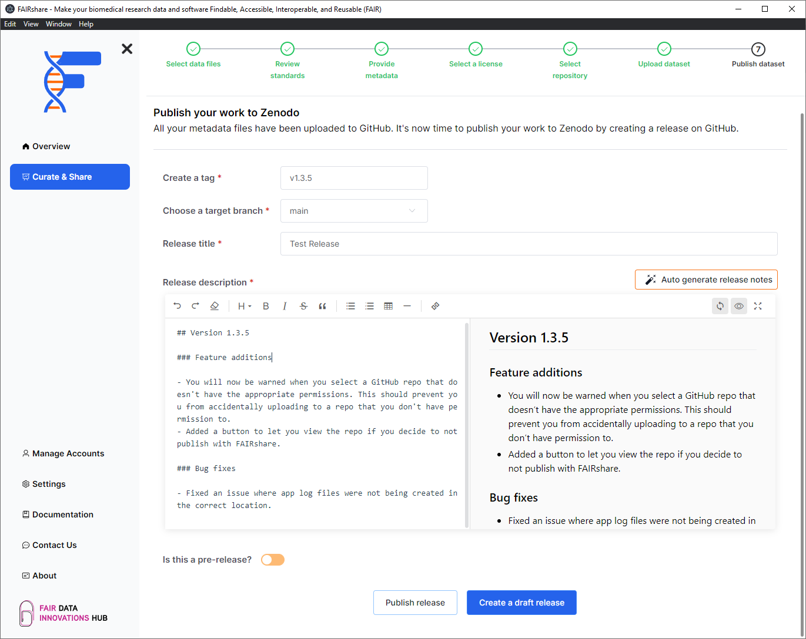

## Background

:::info
You will only see this page if you are uploading a dataset to Zenodo from GitHub.
:::

In order to push your data from GitHub to Zenodo you will need to create a release on GitHub. You can use FAIRshare to automatically create a release on GitHub for you.

## How to

Click on the `Yes, Create a release` button to begin the process.

In the following page you will be asked to enter some information about the release:

- **Tag name**: The tag that you want to use for the release.
  :::tip
  Your previous tags will be shown in the dropdown of this field. When providing a tag name, you will have to provide one that is unique and does not already exist for this repository.
  :::
- **Target branch**: The branch that you want to use for the release.
- **Release title**: The title of the release.
- **Release description**: The description of the release.
  :::tip
  You can use the `Auto generate release notes` button for this purpose. FAIRshare uses GitHub's API's so the items generated here will be the exact same as what you will see on GitHub.
  :::
- **Pre-release**: If you want to make this release a pre-release.

## Draft vs Published releases

When creating a release through FAIRshare you will have two options: Draft or Published.

### Published

When you publish a release, it will be automatically published on GitHub. This will also trigger a webhook on Zenodo to update the release on Zenodo. The only files that will be sent to Zenodo is your source code from GitHub. If you want to upload additional files to your release use the `Create a draft release` button.

:::caution
This action is irreversible.
:::

### Draft

When you create a draft release, it will not be published on GitHub immediately. This will create draft release on GitHub that you can publish at a later time. You can add additional files to your draft release by uploading them to the release on GitHub. For example, if you are making software FAIR and you want to upload built executables to your release, you can create a draft release and upload the executables to the release on GitHub.

:::caution
If you create a draft release through FAIRshare, you will not be able to publish your release through FAIRshare. You will have to use the `Publish release` button on GitHub itself to publish your release at this time.
:::
