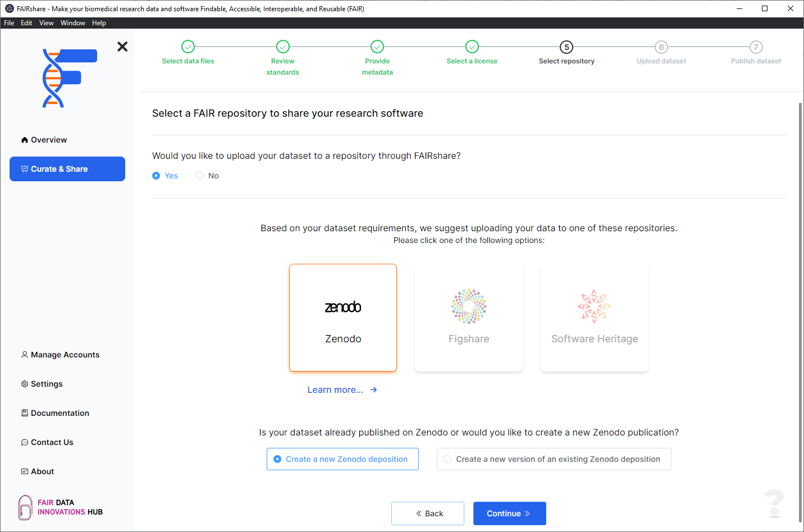
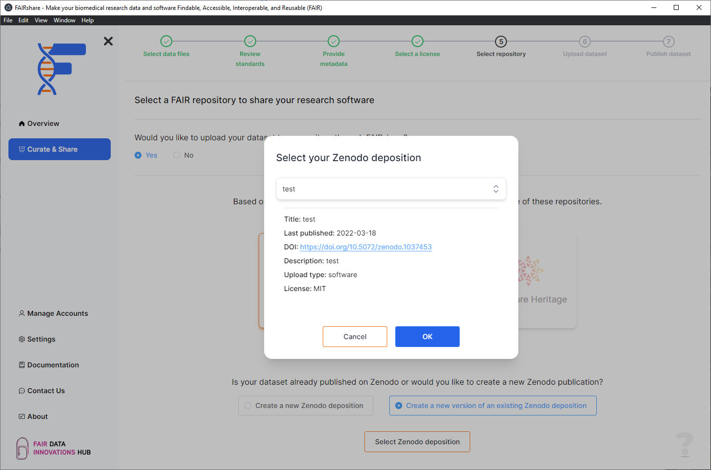

## Background

To make your data FAIR, you are are required to select a destination repository for your data. Within this feature of FAIRshare you can select a repository from the list of repositories that are available to you. This will be where your data will be uploaded to and made available to the public. By completing this step, you will be able to reveive a DOI for your dataset that will be citable by other researchers.

## How to

Select a repository from the list provided.

:::info
Only `Zenodo` is supported at this time. We will be adding support for other data repositories in the future. View the roadmap to see what is in the pipeline. You can let us know if there is a specific repository you would like to see supported.
:::

### Zenodo

FAIRshare supports the ability for you to submit new versions of your depositions directly through the application. This means that you will never have to leave FAIRshare to submit your data to Zenodo. When you select Zenodo as your destination you will be asked for which deposition option you would like to use.

#### Create a new Zenodo deposition

Using this option will create a brand new deposition on Zenodo. When you publish this item, you will get a brand new DOI for your dataset.

#### Create a new version of an existing Zenodo deposition

If you have previously submitted a dataset to Zenodo and would like to submit a new version of your dataset, you can use this option. This should be used if you have made changes to your dataset that you would like to submit as a new version. Your DOI will not change on publishing this new version.

- Connect to Zenodo if you have not already done so.
- Click on the `Select Zendodo deposition` button.
- Select the deposition you would like to submit a new version of.
- Click on the `OK` button.
- Click on the `Continue` button.

import PageFeedback from "@site/src/components/PageFeedback";

<PageFeedback />
