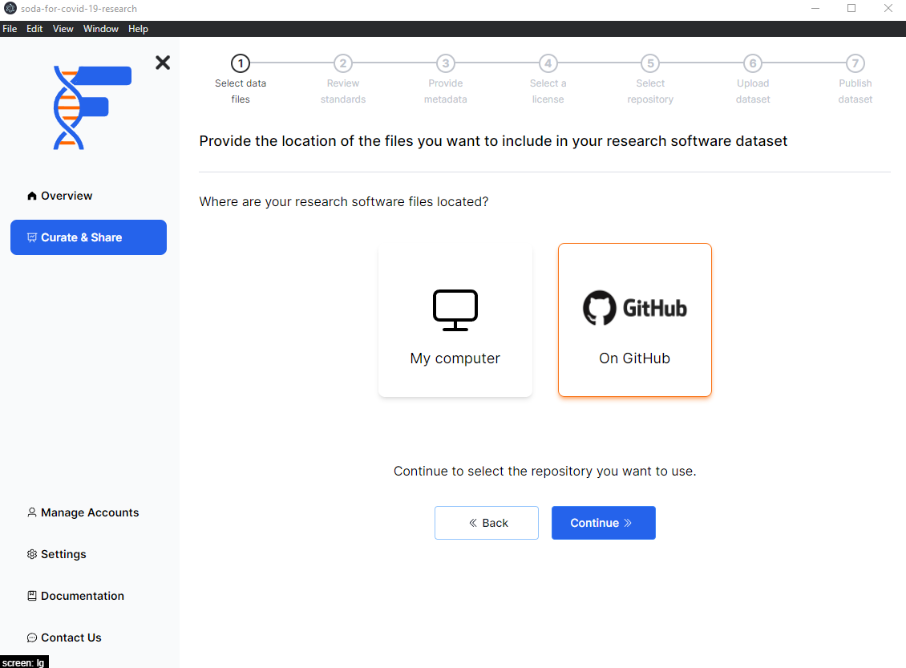

## Background

FAIRshare is able to handle your research software data directly from a GitHub repository. This means that you will only need to select your GitHub repository and FAIRshare will handle the rest.

:::note
To learn more about how to handle a local source folder, please [click here](/)
:::

## How to

- Select the `On GitHub` option.
- Click on the `Continue` button.

On the [next page](/) you will be able to select the repository you want to use.

import PageFeedback from "@site/src/components/PageFeedback";

<PageFeedback />
