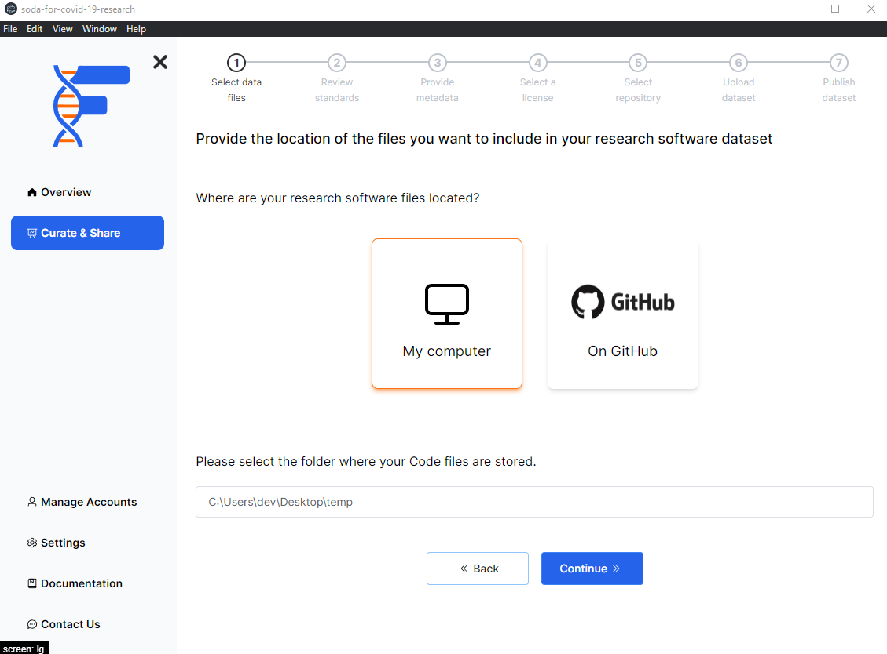

## Background

To get started you will have two options to select the source of your files. You can either use a folder that exists on your computer or a GitHub repository.

:::note
To learn more about how to handle a GitHub repository, please [click here](/)
:::

## How to

- Select the `My computer` option.
- Click on the input box to select the directory.
- Click on the `Continue` button.

:::info
FAIRshare will be expecting a full folder with all of your data within it. If you have subfolders within your folder, FAIRshare will automatically handle the processing of all your items for you.
:::

import PageFeedback from "@site/src/components/PageFeedback";

<PageFeedback />
