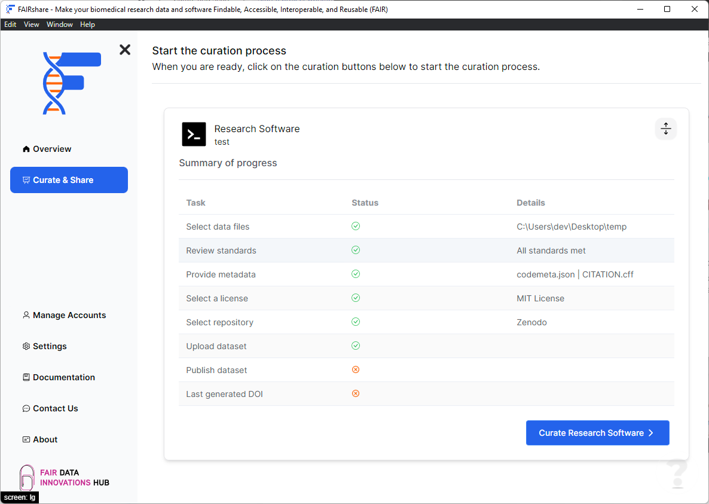

## Background

Each of your project's data types will be separated into individual workflows. Each workflow will be a set of steps that you will need to complete to curate the data. Since each data type is different, each workflow may differ as well.

## How to

Click on the workflow you want to start. FAIRshare will guide you through the steps to complete every workflow. All your changes from this step onwards will be saved automatically so you can come back to it later.

import PageFeedback from "@site/src/components/PageFeedback";

<PageFeedback />
