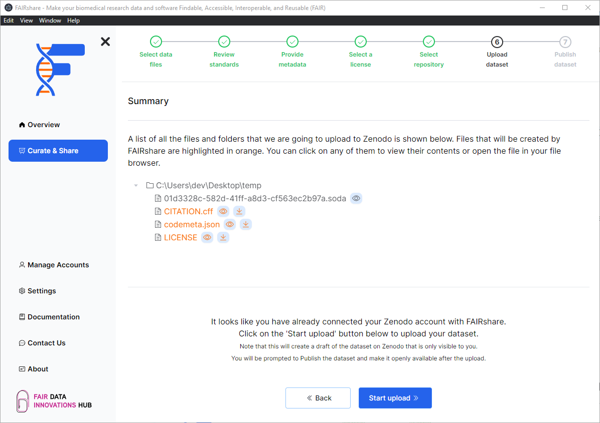

## Background

:::info
You will only see this page if you are uploading a dataset to Zenodo from your local computer.
:::

In this page you will be able to see a quick summary of the files and folders that you have selected to upload to Zenodo. Your files are shown in a tree view. You can click on the `eye`
icon to open the file in a new tab. Files that are shown in orange are the new files that FAIRshare will be adding to your Zenodo deposition. Clicking on the `download` icon will download the file to your computer for you to look at.

Click on the `Start upload` button to begin the upload process.
