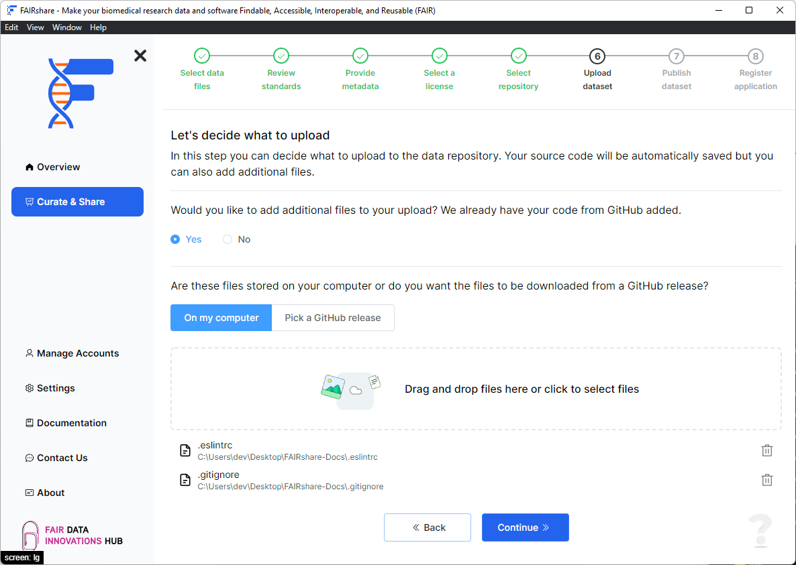
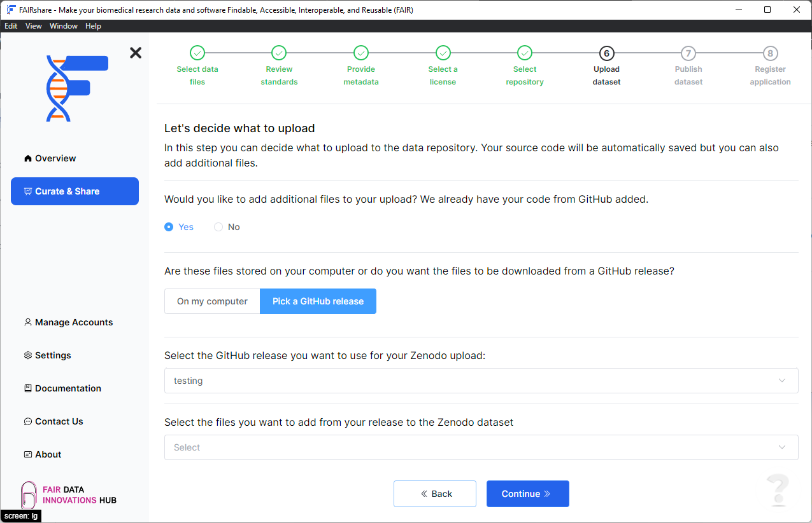

## Background

When you release your dataset on an data archival platform, the current method of transferring your code involves using webhooks within your GitHub repository. This means that you will need to have a GitHub account to use this feature as well as the ability to connect both platforms. There is also a drawback with this method as it removes any additional files from your release.

To overcome this issue FAIRshare uses a different method to archive datasets. We clone your repository as usual but you will now get the option to add additional files to your final dataset. These files can come from two different sources:

- A local folder on your computer
- A GitHub release

## How to

### Add files from a local folder

This option can be used to specify some additional files from your system that you would like to upload with your dataset. This can be useful if you have some additional files that you would like to include in your dataset but are not part of your repository. For example if you do local builds on your system and would like to include the build files in your dataset.

- Select the `On my computer` option.
- Click on the lined input box to select the directory or drag and drop your files into the box.

- Click on the `Continue` button.

### Add files from a GitHub release

This option can be used to specify some additional files from your GitHub repository that you would like to upload with your dataset. This can be useful if you have some additional files that you would like to include in your dataset but are not part of your repository. For software using CI based release outputs, this can be used to include the release files in your dataset.

- Select the `Pick a GitHub release` option.
- Select a release from the list of releases. If you do not have any releases, you will need to create one first.
- Select the files you want to include in your final dataset.

- Click on the `Continue` button.
