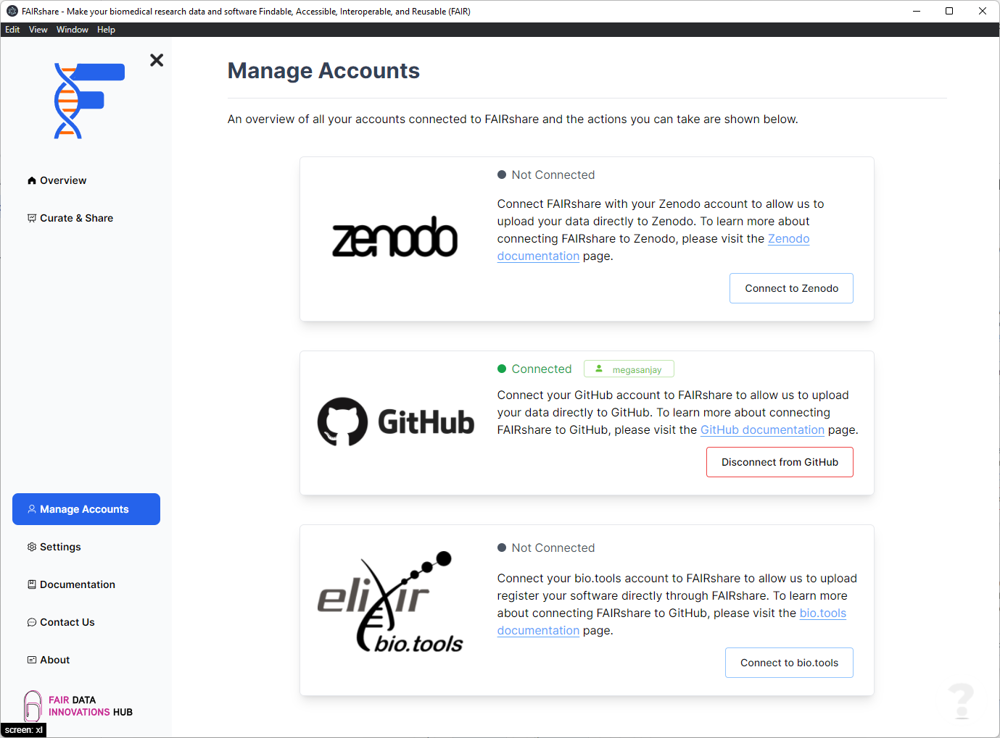
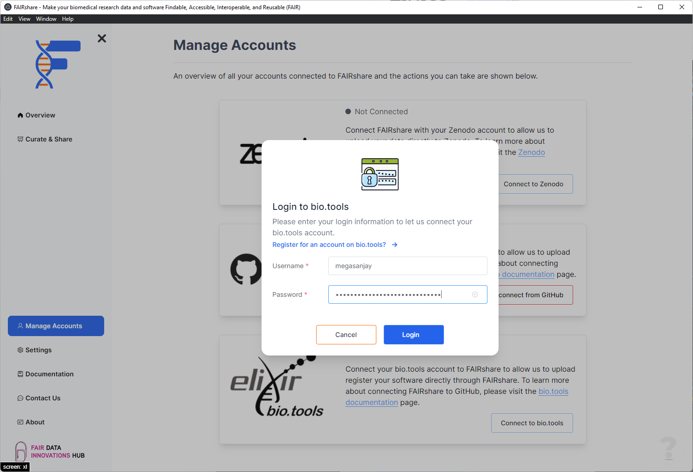

## Overview

To increase the FAIRness of your software, we recommend to register it on the [bio.tools](https://bio.tools) registry. For this purpose, FAIRshare can be used to connect directly to the bio.tools registry and also submit an entry for your applicaion.

## How to

1. Click on the `Connect to bio.tools` at the bottom right position of the card.
   
2. Enter your `username` and `password` to bio.tools.
   
3. Click on the `Login` button to continue. If your credentials are valid FAIRshare will automatically generate the required token and show you a successfully connected notification.

import PageFeedback from '@site/src/components/PageFeedback';

<PageFeedback />
