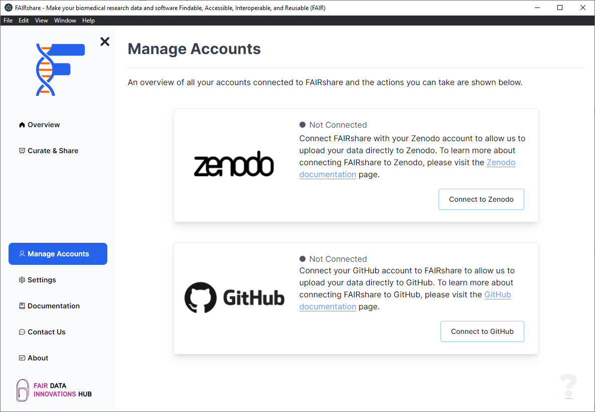
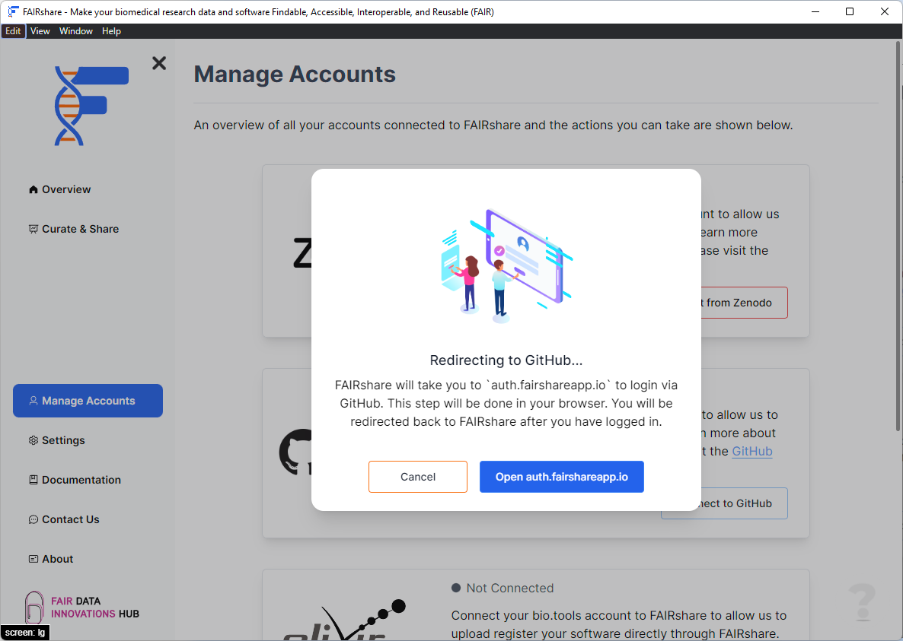

## Overview

FAIRshare can be used to make your research software on GitHub FAIR. This is a great way to share your research with the world and to make it available to the public so we have made it easy to integrate FAIRshare with GitHub.

To connect FAIRshare with GitHub you can either provide a [personal access token](#connect-with-token) with the appropriate scopes or you can allow [FAIRshare to connect with GitHub](#connect-with-username) and create a token for you.

To connect to your GitHub account in FAIRshare, we use a browser based OAuth flow. This means that you will be redirected to GitHub to login and authorize FAIRshare to access your account. Once you have authorized FAIRshare, you will be redirected back to the application and you will be connected to GitHub. This method ensures that we only have access to the information that you authorize us to have. Furthermore we can request all the required scopes for you so you don't have to worry about that.

#### Scopes

The following scopes will be requested from your GitHub account. An explanation of each scope is provided below.

- `repo` - Grants full access to repositories, including private repositories. That includes read/write access to code, commit statuses, repository and organization projects. FAIRshare will need to be able to read and write to your repositories.
- `user` - Grants read/write access to profile info only. FAIRshare will need to be able to read your information from your profile to fill in your information for the relevant metadata files.
- `admin:org_hook` - Grants read and write access to organization hooks. Note: OAuth tokens ([connecting with username](#connect-with-username)) will only be able to perform these actions on organization hooks which were created by the OAuth App. [Personal access tokens](#connect-with-token) will only be able to perform these actions on organization hooks created by a user.
- `admin:repo_hook` - Grants read and write access to repository hooks in public or private repositories. This scope is only requested by FAIRshare to create hooks on repositories for Zenodo or other data repository integration.

### How to

1. Click on the `Connect to GitHub` at the bottom right position of the card.
   
2. Click on the `Open auth.fairshareapp.io` button in the popup.
   

   This url will open in your browser and you will be redirected to GitHub to login and authorize FAIRshare to access your account. Once you have authorized FAIRshare, you will be redirected back to the application and you will be connected to GitHub.

   :::info
   FAIRshare cannot see or read the username or password you enter in this page. If your login is successful FAIRshare only stores an authentication token that allows the application to connect to GitHub and read and write to your repositories.
   :::

3. If your login is successful FAIRshare will show you a successfully connected notification.

import PageFeedback from '@site/src/components/PageFeedback';

<PageFeedback />
